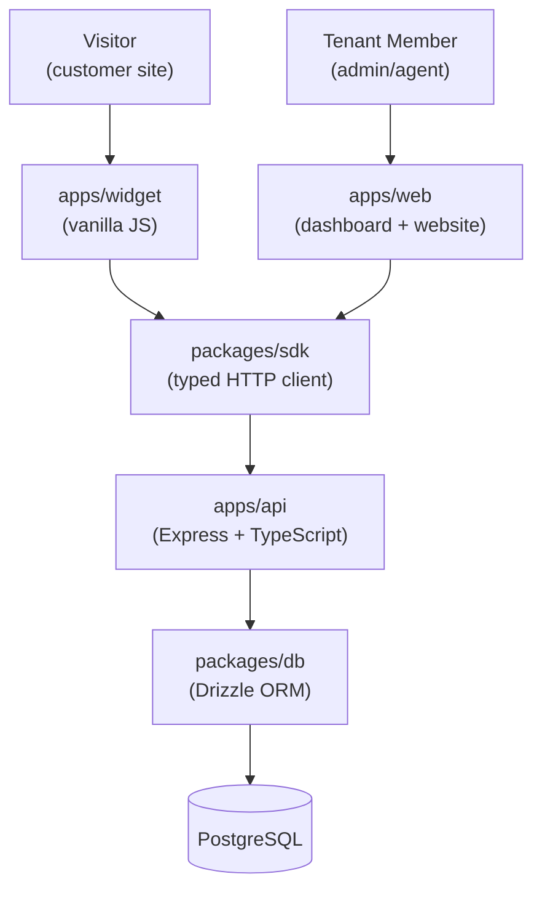

# Parrot

A multi-tenant customer support and chat platform — conversations, tickets, and an embeddable widget, built as a single monorepo.

## Overview

Parrot lets a business (a **tenant**) support their customers (**visitors**) through live chat and tickets. Each tenant has its own **members** (agents/admins) with tenant-specific **roles and permissions**, its own conversations, and its own embeddable chat **widget** for their website.

This is an early-stage / internal project. Expect gaps — sections below are marked `Planned` where the corresponding feature isn't built yet.

## Architecture




- `apps/widget` and `apps/web` never talk to the database directly — everything routes through `apps/api`.
- `packages/sdk` is the only sanctioned way `web`/`widget` call the API.
- `packages/db` is only imported directly by `apps/api`.
- `packages/shared-types` is the shared vocabulary (DB-inferred types + zod schemas) consumed by everything above.

## Tech Stack

| Layer | Choice |
|---|---|
| API | Express.js + TypeScript |
| Database | PostgreSQL |
| ORM | Drizzle |
| Dashboard + Website | Next.js (App Router), Better Auth (cookie-based sessions) |
| Widget | Vanilla JS, HTML, CSS (no framework, minimal bundle) |
| Monorepo tooling | pnpm workspaces + Turborepo |
| Widget bundler | esbuild |

## Monorepo Structure

```
parrot/
├── apps/
│   ├── api/        Express + TypeScript backend, only service that talks to Postgres
│   ├── web/         Next.js app — public marketing site + authenticated tenant dashboard
│   └── widget/      Vanilla JS embeddable chat widget for tenant customer sites
│
├── packages/
│   ├── db/                Drizzle schema, migrations, seed scripts, DB client
│   ├── shared-types/      Shared TypeScript types + zod schemas, largely inferred from packages/db
│   ├── shared-utils/      Framework-agnostic helper functions shared across apps
│   └── sdk/               Typed HTTP client wrapping apps/api, used by web and widget
│
├── docs/
│   ├── architecture/      System design docs
│   ├── adr/                Architecture Decision Records
│   ├── diagrams/           Visual diagrams (schema, flows, etc.)
│   └── api/                API reference docs
│
├── docker/                Per-app Dockerfiles / local infra
├── .github/                CI workflows
├── pnpm-workspace.yaml
├── turbo.json
└── package.json
```

## Prerequisites

- Node.js (LTS — see `.nvmrc` if present)
- pnpm (version pinned in root `package.json`'s `packageManager` field)
- Docker (for local Postgres via `docker-compose`)
- PostgreSQL (via Docker, or a local install)

## Getting Started / Local Setup

```bash
# Clone
git clone <repo-url>
cd parrot

# Install all workspace dependencies
pnpm install

# Copy env files (see Environment Variables section)
cp apps/api/.env.example apps/api/.env
cp apps/web/.env.example apps/web/.env
cp packages/db/.env.example packages/db/.env

# Start local Postgres
docker compose up -d

# Run migrations
pnpm --filter @parrot/db migrate

# Seed local data
pnpm --filter @parrot/db seed
```

## Running the Apps

```bash
# Run everything in dev mode
pnpm dev

# Or run a single app
pnpm --filter @parrot/api dev
pnpm --filter @parrot/web dev
pnpm --filter @parrot/widget dev
```

| App | Default URL |
|---|---|
| `api` | http://localhost:3001 |
| `web` | http://localhost:3000 |
| `widget` | served as a static bundle — see [Widget Embedding](#widget-embedding) |

## Environment Variables

### `apps/api/.env`

| Variable | Description |
|---|---|
| `DATABASE_URL` | Postgres connection string |
| `PORT` | API server port (default `3001`) |
| `BETTER_AUTH_SECRET` | Session signing secret |
| `CORS_ORIGIN` | Allowed origin(s) for `apps/web` and `apps/widget` |

### `apps/web/.env`

| Variable | Description |
|---|---|
| `NEXT_PUBLIC_API_URL` | Base URL of `apps/api` |
| `BETTER_AUTH_SECRET` | Must match the API's secret |
| `BETTER_AUTH_URL` | Base URL of the web app |

### `packages/db/.env`

| Variable | Description |
|---|---|
| `DATABASE_URL` | Postgres connection string used by Drizzle Kit |

`.env.example` files in each package are the source of truth — keep this table in sync with them.

## Database & Migrations

Schema lives in `packages/db/src/schema.ts` as Drizzle table definitions.

```bash
# Generate a migration from schema changes
pnpm --filter @parrot/db generate

# Apply pending migrations
pnpm --filter @parrot/db migrate

# Open Drizzle Studio (visual DB browser)
pnpm --filter @parrot/db studio

# Seed local dev data
pnpm --filter @parrot/db seed
```

Never edit a generated migration file after it's been applied to a shared environment — generate a new one instead.

## Authentication

There are two distinct auth flows in this system:

- **Tenant members** (agents/admins): authenticated via Better Auth, cookie-based sessions, gated by Next.js middleware on dashboard routes.
- **Visitors** (customers using the widget): anonymous/session-token based, scoped per conversation — no login required.

These flows are handled separately in `apps/api` and should not be conflated in shared middleware.

## Multi-Tenancy Model

Every tenant-scoped table carries a `tenant_id`. A `tenant_members` join table ties a global `users` record to a `tenant` with a tenant-specific `role_id` — the same person can belong to multiple tenants with a different role in each. All API queries resolve `tenant_id` from the authenticated session via middleware before touching the database; no query should run without it.

## API Overview

Full reference: [`docs/api`](./docs/api).

Routes follow a `routes → controllers → services → repositories` layering. Tenant resolution happens in middleware before any controller logic runs. *(Planned: OpenAPI/Swagger spec.)*

## Widget Embedding

*(Planned — widget is not yet embeddable.)*

Once available, a tenant will embed the widget on their site via a script tag, e.g.:

```html
<script src="https://cdn.parrot.example/widget.js" data-tenant-id="TENANT_ID" defer></script>
```

The widget renders inside a Shadow DOM to avoid CSS conflicts with the host page.

## Testing

*(Planned — no test suite yet.)*

```bash
pnpm test
```

## Building for Production

```bash
pnpm build
```

Turborepo builds each package/app in dependency order (`packages/db` → `packages/shared-types` → `packages/sdk` → `apps/*`).

## Deployment

| App | Notes |
|---|---|
| `api` | Runs as a Node server (Docker container) — see `docker/api` |
| `web` | Runs as a Node server (Next.js with middleware/SSR — not statically exported due to auth middleware) |
| `widget` | Built as a static bundle via esbuild, deployed to a CDN |

*(Planned: finalize hosting targets and CI/CD pipeline.)*

## Contributing

- Branch naming: `feature/*`, `fix/*`, `chore/*`.
- Open a PR against `main`; at least one review required.
- Significant architectural decisions should be recorded as an ADR in [`docs/adr`](./docs/adr) before implementation.

## Project Documentation

- [`docs/architecture`](./docs/architecture) — system design docs
- [`docs/adr`](./docs/adr) — architecture decision records
- [`docs/diagrams`](./docs/diagrams) — schema and flow diagrams
- [`docs/api`](./docs/api) — API reference
