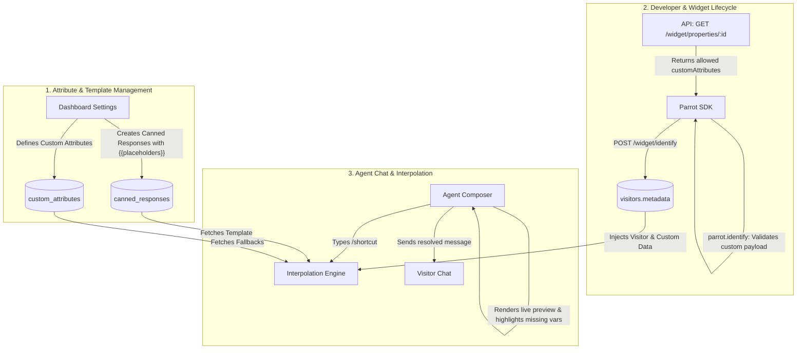

# Canned Responses & Dynamic Placeholders Architecture

Transforms static text canned responses into a dynamic templating engine powered by tenant-defined custom attributes, SDK validation, and real-time agent composer interpolation.

---

## 1. High-Level Architecture



---

## 2. Motivation & Current Limitations

- **Static text only:** Canned responses are hardcoded strings. Agents must manually backspace and type customer names, account IDs, or plan types.
- **Human error ("Unfilled Template Blunder"):** In fast-paced support queues, agents frequently send templates with unedited placeholders like `[Customer Name]` or `[Company]`.
- **Disconnection between Dev & Agent:** Developers pass rich context (`plan`, `renewalDate`, `company`) via the V2 `identify` endpoint, but agents have no standardized way to reference that data in saved templates.
- **Hardcoded auto-replies:** System fallback messages (e.g. offline auto-reply) cannot dynamically reference visitor details or property configuration.

---

## 3. Variable Namespaces

To prevent naming collisions and make autocomplete intuitive, variables are divided into four clear namespaces:

| Namespace | Source | Description | Examples |
| :--- | :--- | :--- | :--- |
| **`visitor.*`** | Core `visitors` table | Built-in visitor profile fields | `{{visitor.name}}`, `{{visitor.email}}`, `{{visitor.phone}}` |
| **`custom.*`** | `visitors.metadata` (JSONB) | Tenant-defined custom attributes | `{{custom.plan}}`, `{{custom.company}}`, `{{custom.renewalDate}}` |
| **`agent.*`** | Active session user | Details of the agent sending the message | `{{agent.firstName}}`, `{{agent.fullName}}`, `{{agent.email}}` |
| **`tenant.*`** | `tenants` & `properties` | Organization and property metadata | `{{tenant.name}}`, `{{property.name}}` |

---

## 4. Custom Attributes Data Dictionary (Schema)

To ensure agents have a curated, typo-free list of variables, tenants explicitly register custom attributes in the dashboard (*Settings > Custom Attributes*).

### Database Schema (`custom_attributes`)

```typescript
export const customAttributes = pgTable(
  "custom_attributes",
  {
    id: uuid("id").primaryKey().defaultRandom(),
    tenantId: uuid("tenant_id")
      .notNull()
      .references(() => tenants.id, { onDelete: "cascade" }),
    key: text("key").notNull(),                          // e.g. "plan" (used in templates)
    label: text("label").notNull(),                      // e.g. "Subscription Plan" (shown in UI)
    description: text("description"),                   // e.g. "The customer's active pricing tier"
    type: text("type").notNull().default("string"),     // "string" | "number" | "boolean" | "date"
    defaultValue: text("default_value"),                // e.g. "Starter" (global fallback)
    createdAt: timestamp("created_at", { withTimezone: true }).notNull().defaultNow(),
    updatedAt: timestamp("updated_at", { withTimezone: true }).notNull().defaultNow(),
  },
  (table) => [
    index("idx_custom_attributes_tenant_id").on(table.tenantId),
    uniqueIndex("uq_custom_attributes_tenant_key").on(table.tenantId, table.key),
  ]
);
```

---

## 5. Developer Contract & Widget Validation

### A. Config Export
When the widget initializes, `GET /widget/properties/:propertyId` returns the registered attribute dictionary:

```json
{
  "property": {
    "id": "d5646386-...",
    "name": "Acme App",
    "customAttributes": [
      {
        "key": "plan",
        "label": "Subscription Plan",
        "type": "string",
        "defaultValue": "Free"
      },
      {
        "key": "renewalDate",
        "label": "Next Renewal Date",
        "type": "date"
      }
    ]
  }
}
```

### B. Client-Side Validation in SDK
When the developer initializes Parrot or calls `parrot.identify()`:

```javascript
parrot.identify({
  name: "Alex Johnson",
  email: "alex@acme.com",
  custom: {
    plan: "Enterprise",
    unknown_attr: 123
  }
});
```

1. **Validation:** The SDK compares keys in `custom` against the `customAttributes` list.
2. **Non-Fatal Warnings:** If an unregistered key or type mismatch is found:
   - **Production:** Logs a non-intrusive console warning:  
     `console.warn("[Parrot SDK] Custom attribute 'unknown_attr' is not registered in Dashboard > Settings > Custom Attributes.")`
   - **Dev Mode (`debug: true`):** Emits detailed debug traces to help the developer fix their payload during integration.
   - **No Fatal Errors:** The SDK **never** throws an uncaught JavaScript error that could crash the host website.
3. **Storage:** The backend persists the entire `custom` object into `visitors.metadata` JSONB so no customer data is lost.

---

## 6. Template Syntax & Fallback Rules

Templates support two forms of variable interpolation:

### A. Standard Interpolation
```text
Hi {{visitor.name}}, thanks for reaching out!
```
- If `visitor.name = "Alex"` → *"Hi Alex, thanks for reaching out!"*

### B. Inline Fallback Syntax
```text
Hi {{visitor.name | "there"}}, your {{custom.plan | "current"}} plan renews on {{custom.renewalDate | "the 1st"}}.
```
- If `visitor.name` is null/empty → falls back to `"there"`: *"Hi there..."*
- If `custom.plan` is missing → falls back to `"current"`: *"...your current plan..."*

### C. Fallback Precedence Order
When resolving a variable `{{custom.key}}`:
1. **Visitor Value:** Value from `visitors.metadata[key]`.
2. **Template Inline Fallback:** The pipe fallback defined in the template: `{{custom.key | "fallback"}}`.
3. **Global Attribute Default:** `custom_attributes.defaultValue` defined in the dashboard settings.
4. **Empty / Missing:** If none exist, flag as unresolved.

---

## 7. Agent Composer & AX Workflow

### A. Autocomplete Dropdown (`{{` or `/`)
When an agent is drafting a canned response in Settings or typing in the active chat composer:
- Typing `{{` triggers a grouped autocomplete menu:
  - **Visitor Profile** (`{{visitor.name}}`, `{{visitor.email}}`)
  - **Custom Attributes** (`{{custom.plan}} - Subscription Plan`, `{{custom.company}} - Company Name`)
  - **Agent** (`{{agent.firstName}}`, `{{agent.fullName}}`)
  - **Workspace** (`{{tenant.name}}`)

### B. Slash Command Expansion (`/shortcut`)
When an agent types `/welcome` in the composer:
1. The template content is fetched from the client cache.
2. The client-side **Interpolation Engine** immediately resolves variables using the current conversation's visitor profile and active agent session.
3. The composer displays the **resolved live text**.

### C. Missing Variable Warnings & Guardrails
If a template contains a variable with **no available value and no fallback**:
- The unresolved variable is highlighted in **amber/pill format** inside the composer:  
  `Hi Alex, your [Missing: renewalDate] plan has been updated.`
- Clicking the pill lets the agent type the value directly in place.
- If the agent attempts to hit **Send** while a missing placeholder remains, the composer prompts: *"Some placeholders are unfilled. Send anyway or fill them in?"*

---

## 8. Backend Auto-Reply Integration

When an incoming conversation goes unhandled and triggers the background BullMQ `autoReply` worker:

1. Rather than sending a hardcoded string, `autoReply` fetches the tenant's configured auto-reply canned response template.
2. The server-side interpolation helper merges:
   - `visitor`: DB record (`visitors.name`, `visitors.email`)
   - `custom`: DB record (`visitors.metadata`)
   - `tenant` / `property`: Organization metadata
3. The interpolated message is inserted into `messages` and broadcasted via WebSocket.

---

## 9. What Changes: V1 (Static) vs. V2 (Dynamic)

| Feature | V1 (Current) | V2 (Dynamic Engine) |
| :--- | :--- | :--- |
| **Canned Response Content** | Raw static string | Template string with `{{namespace.key}}` placeholders |
| **Custom Attributes** | None (unstructured metadata) | Explicit `custom_attributes` registry per tenant |
| **Fallback Handling** | None | Multi-tier fallbacks (Inline pipe `\|` → Global default → Composer prompt) |
| **Developer DX** | Blind JSON payload | SDK validates against registered attributes with console warnings |
| **Agent AX** | Static expansion only | Live preview, variable autocomplete, missing value guardrails |
| **Auto-Reply** | Hardcoded string literal in repository | Dynamic template interpolation via background worker |
