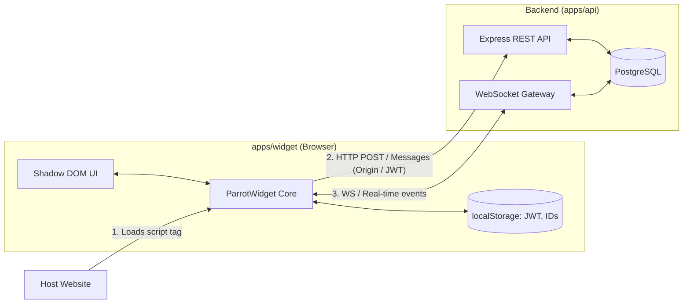

# Current Widget Architecture (V1)

A zero-config, drop-in live chat widget running in an encapsulated Shadow DOM.

---

## 1. High-Level Architecture

---

## 2. How It Works

### A. Initialization & JWT Check
1. **Mount & Storage Check:** When the widget initializes and mounts the Shadow DOM, it checks `localStorage` for an existing visitor **JWT token**:
   * **Returning Visitor (Valid JWT):** If the token exists and is within its validity period (7-day TTL configured via `generateJWT`), the conversation is resumed, and message history is fetched via `GET /widget/conversations/:conversationId/messages` using `Authorization: Bearer <JWT>`.
   * **Stale Session (Expired JWT):** If expired (older than 7 days), `decodeJWT` returns `null`, the session is assumed stale, local storage keys are purged, and the widget resets to a clean state.
   * **First-Time Visitor (No JWT):** The widget fetches public property settings (`GET /widget/properties/:propertyId`) to render branding and online status, then waits for the visitor to send their first message.

### B. First Message & JWT Generation
1. **Origin Verification:** Because a new visitor has no auth token, `conversationRepository.createVisitorMessage` verifies the request's HTTP `Origin` header against the property’s registered `allowedDomains`.
2. **Token Issuance:** On the first `POST /widget/messages`, the API provisions the visitor and conversation records, signs a JWT containing `{ conversationId, visitorId }`, and returns it in the response payload.
3. **Session Attachment:** The widget saves the JWT into `localStorage` (`parrot_visitor_token`) and attaches it as `Authorization: Bearer <token>` for all subsequent authenticated requests.

---

## 3. Current Limitations & Tradeoffs

* **Unauthenticated Message Endpoint Exposure:** First-time visitors can call `POST /widget/messages` without a JWT. While protected by origin checks and rate limiters, it remains an open entry point.
* **Unauthenticated WebSocket Connections:** The WebSocket gateway accepts connections (`/ws?type=visitor&visitorId=...`) based purely on client-supplied `visitorId` query params without requiring upfront JWT handshake verification.
* **No Host SDK Interface:** No global `window.Parrot` API is exposed for the host page to control the widget.
* **Anonymous Visitors Only:** The host application cannot pass user context (`name`, `email`, `plan`, `custom metadata`).
* **Shadow DOM CSS Leaks:** Host page global CSS rules (`line-height`, `font-family`, CSS resets) can still bleed into the shadow root.
* **No SPA Lifecycle Support:** Cannot handle user login/logout or account switching without a hard page refresh.
