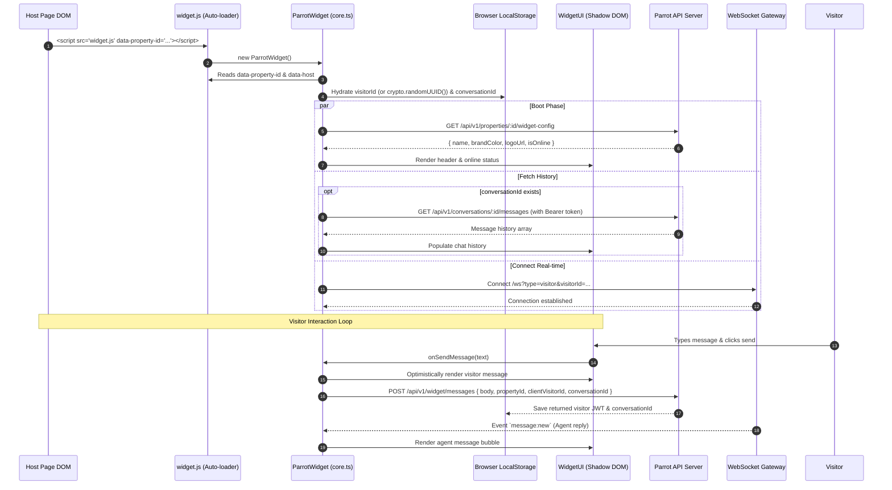

# Current Widget Architecture (V1)

> **Document Type:** System Architecture Specification  
> **Status:** Current Implementation (Baseline)  
> **Location:** `apps/widget`

---

## 1. Overview & Design Philosophy

The current Parrot widget is built as a **zero-configuration, self-initializing drop-in bundle**. It is designed to be embedded on any customer website with a single `<script>` tag, rendering inside an encapsulated `Shadow DOM` without requiring any host-page JavaScript frameworks.

### Core Principles of V1:
* **Zero Host Configuration:** The widget auto-boots immediately upon script execution by inspecting attributes on its own `<script>` tag.
* **Shadow DOM Style Isolation:** Mounts to `document.body` inside an open `ShadowRoot` to prevent host page CSS collisions.
* **Anonymous Visitor-First Identity:** Generates an opaque UUID for each visitor in browser `localStorage`.
* **Hybrid Transport:** Uses standard HTTP `POST` requests for transactional writes and persistent WebSockets for downstream push events (messages, typing indicators).

---

## 2. Monorepo & File Structure

```
apps/widget/
├── src/
│   ├── index.ts          # Entry point & auto-initialization hook
│   ├── core.ts           # ParrotWidget class (state management & orchestrator)
│   ├── ui.ts             # WidgetUI class (Shadow DOM creation, HTML template, events)
│   ├── api.ts            # WidgetApi class (HTTP & WebSocket transport wrapper)
│   ├── types.ts          # State and message interfaces
│   └── styles/
│       └── main.css      # Inlined widget stylesheet
├── example/
│   └── index.html        # Local test harness
└── vite.config.ts        # Bundler config (single bundle: dist/widget.js)
```

---

## 3. End-to-End Architecture & Data Flow



---

## 4. Component Breakdown & Internal Logic

### A. Initialization (`src/index.ts`)
* Automatically checks `document.readyState`.
* If DOM is still loading, binds to `DOMContentLoaded`; otherwise, instantiates `new ParrotWidget()` immediately.

### B. State Management & Orchestration (`src/core.ts`)
* **DOM Attribute Parsing:** Queries `document.currentScript` or `script[data-property-id]` to extract:
  * `data-property-id`: The tenant's property UUID.
  * `data-host`: The API base URL (defaults to `http://localhost:8080`).
* **Identity Hydration:**
  * Checks `localStorage.getItem("parrot_visitor_id")`. If missing, generates `crypto.randomUUID()` and persists it.
  * Checks `localStorage.getItem("parrot_conversation_id")`.
* **State Shape:**
  ```typescript
  interface WidgetState {
    isOpen: boolean;
    isOnline: boolean;
    messages: WidgetMessage[];
    propertyConfig: WidgetPropertyConfigDto | null;
    propertyId: string;
    visitorId: string;
    conversationId: string | null;
    isTyping: boolean;
  }
  ```
* **Optimistic Updates & Auto-Recovery:**
  * Messages are appended locally to `state.messages` prior to network response.
  * If a `401 Unauthorized` occurs (e.g. expired JWT token), it clears stale storage keys, resets `conversationId`, and re-triggers as a fresh conversation.

### C. Shadow DOM UI Renderer (`src/ui.ts`)
* **Host Element:** Injects a root `<div id="parrot-widget-host">` at the end of `document.body` with fixed viewport positioning (`bottom: 20px; right: 20px; z-index: 2147483647`).
* **Shadow Root:** Creates `host.attachShadow({ mode: "open" })`.
* **CSS Inlining:** Imports raw CSS as an inlined string using Vite (`import styles from "./styles/main.css?inline"`) and injects a `<style>` element into the shadow root.
* **Component Layout:**
  * `.launcher-btn`: Floating circular button with chat icon / close toggle.
  * `.chat-window`: Collapsible chat container with header, status badge, message stream, and message input.

### D. Transport & API Layer (`src/api.ts`)
* Wraps `@parrot/sdk`'s `ParrotClient`.
* Attaches `Bearer <parrot_visitor_token>` stored in `localStorage` to all HTTP requests.
* Establishes a native WebSocket connection via `client.ws.connect({ type: "visitor", visitorId })`.
* Listens for ephemeral events:
  * `message:new`: Appends incoming agent or system replies.
  * `typing:start`: Activates the 3-second debounced typing indicator bubble.

---

## 5. Storage Model (`localStorage`)

The widget currently manages 3 keys in the browser's `localStorage` on the host origin:

| Key | Purpose | Lifetime |
| :--- | :--- | :--- |
| `parrot_visitor_id` | Client-generated UUID representing the physical device/browser. | Persistent across sessions |
| `parrot_conversation_id` | UUID of the active conversation thread. | Persistent until conversation reset |
| `parrot_visitor_token` | Signed JWT issued by the API authorizing read access to the conversation. | Rotated / verified on requests |

---

## 6. Architectural Constraints & Limitations of V1

1. **No Host-to-Widget SDK Interface:**
   * There is no global `window.Parrot` object or programmatic API exposed to the host page.
   * Tenants cannot trigger widget actions (e.g., `open()`, `close()`, `toggle()`) from their own buttons.
2. **Permanent Visitor Anonymity:**
   * The host application cannot pass logged-in user information (`name`, `email`, `plan`, `userId`, `custom attributes`).
   * Visitors remain completely anonymous until an agent manually asks for their details or an offline fallback auto-replies.
3. **Shadow DOM Vulnerabilities:**
   * While Shadow DOM protects against selector bleed, inherited CSS rules (such as `line-height`, `font-family`, CSS variables, and global CSS resets applied to `:root`) can still leak into the shadow tree on certain host frameworks.
4. **Single-Page Application (SPA) Blindness:**
   * The widget has no awareness of user login/logout events or route transitions in SPAs without full page reloads.
5. **Coupled Embedding:**
   * The widget cannot be rendered outside the host page (e.g., as a standalone hosted chat page) without loading the full host DOM.
