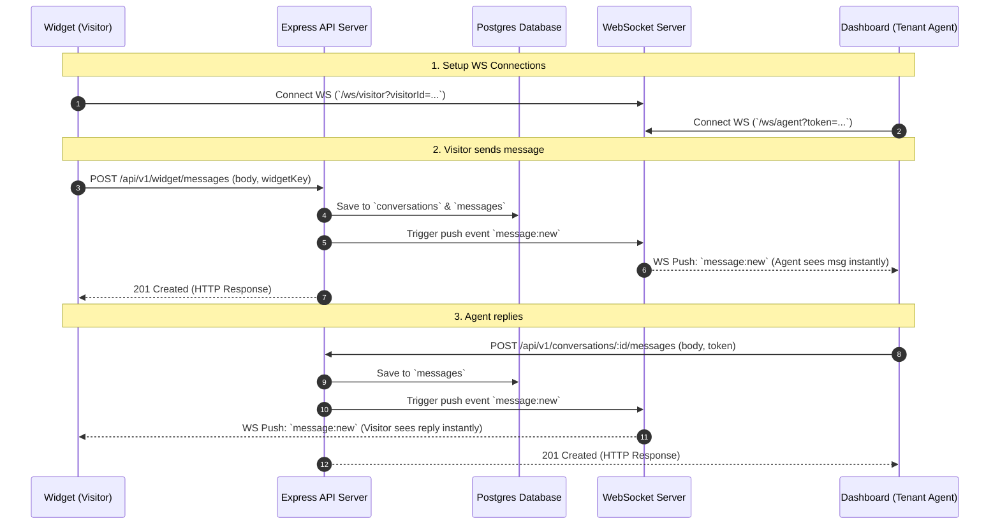

# Parrot V1 — Minimal Messaging Architecture

> **Architecture Spec (v1 MVP)**  
> **Pattern**: HTTP `POST` for Writes (Message Creation) + WebSockets for Downstream Real-Time Push (Notifications).

---

## 1. Overview & Core Philosophy

For the initial MVP (v1), we prioritize **reliability, developer ergonomics, and failure safety** over premature optimization.

* **HTTP `POST` for Message Creation**: Both visitors and agents send messages via standard REST API endpoints. This leverages existing Express validation (`zod`), error handling, and database transactions (`drizzle`). If a DB write fails, the HTTP client gets an immediate, explicit error code (`400`/`500`).
* **WebSockets for Downstream Push**: WebSockets are used strictly as a read/notification channel to push newly saved messages to online agents and visitors instantly.

---

## 2. End-to-End Sequence Diagram



---

## 3. V1 Simplifying Assumptions

To keep the initial implementation minimal and robust, v1 operates on the following explicit assumptions:

1. **Presence**: Assume all online tenant members connected via WebSocket should receive all new conversation/message broadcasts for their `tenantId`.
2. **Offline Fallback**: Offline email digests and Redis queue retries are deferred to v2. If an agent is not connected to WS when a message arrives, the message is safely stored in Postgres for when they next open the dashboard.
3. **Broadcasting**: Messages sent by visitors are broadcasted to all connected sockets in `room:tenant:<tenantId>`. Messages sent by agents are delivered directly to `room:visitor:<visitorId>`.

---

## 4. API & WebSocket Specifications

### A. REST Endpoints (`apps/api`)

#### 1. Visitor Message Creation
* **Endpoint**: `POST /api/v1/widget/messages`
* **Auth**: `widgetKey` (Header or Body) + `visitorToken`
* **Body**:
  ```json
  {
    "widgetKey": "uuid-v4",
    "visitorToken": "opaque-token-or-uuid",
    "conversationId": "optional-uuid-if-continuing",
    "body": "Hello, I need help with my account."
  }
  ```
* **Behavior**:
  * If `conversationId` is omitted, creates a new `conversations` record first.
  * Creates a new `messages` record (`senderType: 'visitor'`).
  * Emits WS event to `room:tenant:<tenantId>`.

#### 2. Agent Reply Creation
* **Endpoint**: `POST /api/v1/conversations/:conversationId/messages`
* **Auth**: `Bearer <sessionToken>` (via `requireAuth` & `requireTenant` middleware)
* **Body**:
  ```json
  {
    "body": "Hi there! I'd be happy to help you with that."
  }
  ```
* **Behavior**:
  * Creates a new `messages` record (`senderType: 'agent'`, `agentId: user.id`).
  * Emits WS event to `room:visitor:<visitorId>`.

---

### B. WebSocket Push Events

#### Event: `message:new`
Pushed by the server to connected clients when a message is successfully persisted.

```json
{
  "event": "message:new",
  "data": {
    "id": "msg_123",
    "conversationId": "conv_456",
    "tenantId": "tenant_789",
    "senderType": "visitor", // or "agent"
    "body": "Hello, I need help with my account.",
    "createdAt": "2026-07-25T13:20:00.000Z"
  }
}
```

---
