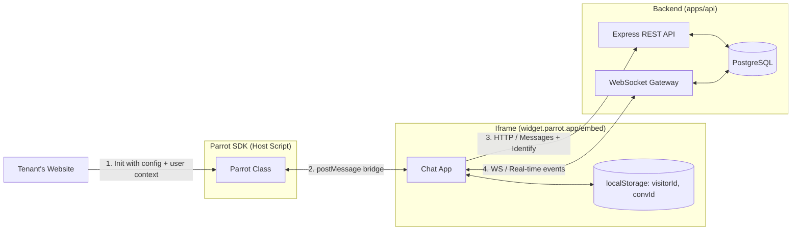
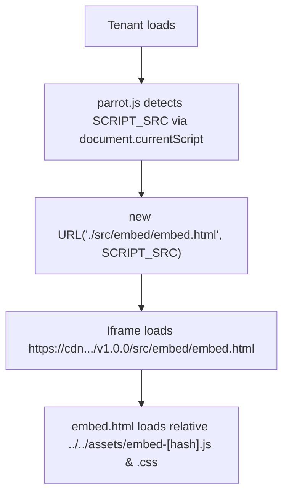

# Widget Architecture V2 — SDK + Iframe Overhaul

Replaces the zero-config Shadow DOM widget with a two-class architecture: a host-side SDK wrapper and an isolated iframe chat client.

---

## 1. High-Level Architecture



---

## 2. Motivation

- **Anonymous-only visitors:** Tenants cannot pass logged-in user context (name, email, plan, custom attributes) to the widget. Agents are blind to who they're talking to.
- **Shadow DOM CSS leaks:** Inherited styles (`font-family`, `line-height`, CSS resets) bleed into the widget on certain host frameworks.
- **No standalone capability:** The widget cannot render outside a host page (e.g., as a shareable chat link).
- **No programmatic control:** No SDK methods for tenants to open, close, or reset the widget from their own code.

---

## 3. The Two Classes

### A. Parrot Class (Host Script)
A lightweight script (~3KB) loaded on the tenant's website. It is the public-facing SDK.

**Responsibilities:**
- Accept tenant configuration and optional user context.
- Inject a hidden, borderless `<iframe>` pointing to the Parrot-hosted embed page.
- Manage iframe dimensions (collapsed launcher vs. open chat window vs. mobile fullscreen).
- Listen for `postMessage` events from the iframe (`PARROT_READY`, `PARROT_RESIZE`, `PARROT_OPEN`, `PARROT_CLOSE`).
- Expose lifecycle methods to the tenant's application.

**Tenant-Facing API:**
```javascript
const parrot = new Parrot({
  propertyId: "d5646386-c2ab-4d02-b9f2-cc04273b15b6",
  user: {                                     // optional
    name: "Alex Johnson",
    email: "alex@acme.com",
    phone: "+1 555-0199",
    custom: {
      plan: "Enterprise",
      company: "Acme Corp",
      renewalDate: "2026-11-01"
    }
  }
});

parrot.open();                // Programmatically open chat
parrot.close();               // Programmatically close chat
parrot.identify({ ... });     // Update user context after init
parrot.reset();               // Clear visitor session, start fresh
```

### B. Iframe App (Chat Client)
The self-contained chat application running inside the iframe. This is essentially the current widget core with JWT removed.

**Responsibilities:**
- Wait for `PARROT_INIT` message from the host Parrot class before booting.
- Fetch property config (`GET /widget/properties/:propertyId`).
- Validate the host's origin against the config's `allowedDomains` (client-side courtesy check).
- Manage visitor identity and conversation state in its own `localStorage`.
- Handle all messaging (HTTP writes) and real-time events (WebSocket reads).
- Fire `POST /widget/identify` to enrich the visitor record when user context is available.
- Communicate dimension/state changes back to the host via `postMessage`.

---

## 4. Initialization & postMessage Handshake

```
1. Tenant page loads → Parrot class instantiated
2. Parrot class injects <iframe src="widget.parrot.app/embed?propertyId=...">
3. Iframe finishes loading → sends PARROT_READY to window.parent
4. Parrot class receives PARROT_READY → replies with PARROT_INIT { propertyId, userContext }
5. Iframe boots: fetches config, validates host domain, hydrates localStorage
```

The reverse handshake (`READY` → `INIT`) prevents the race condition where the host sends `PARROT_INIT` before the iframe's event listeners are registered. If the tenant calls methods (e.g., `parrot.open()`) before `PARROT_READY`, the Parrot class queues them and flushes on ready.

---

## 5. Visitor Identity & Storage

JWT is removed entirely. The iframe uses two storage layers:

**`localStorage` (persistent across sessions):**

| Key | Purpose |
| :--- | :--- |
| `parrot_visitor_id` | Client-generated UUID for this browser/device |

**`sessionStorage` (cleared when tab closes):**

| Key | Purpose |
| :--- | :--- |
| `parrot_current_conversation_id` | The active, ongoing conversation for this tab session |

When a tab closes, `currentConversationId` is lost. On the next visit, the visitor lands on a fresh chat. Past conversations are fetched from the API, not cached locally.

No tokens, no expiration, no 401 recovery logic.

---

## 6. Widget UI Tabs

The widget chat window has two tabs:

- **Current Chat:** The live, ongoing conversation for this session. Powered by `sessionStorage` (`currentConversationId`). When a visitor opens the widget fresh (new tab, new session), they start here with an empty chat. Once they send a message, the conversation is created and the thread is live.
- **Messages:** A list of all past conversations, like a chat app inbox. Fetched from `GET /widget/conversations?clientVisitorId=...&propertyId=...`. Each row shows a conversation preview (last message snippet, timestamp). Tapping a conversation fetches its messages and displays the thread. Past conversations are read-only — the visitor continues chatting in the Current Chat tab.

---

## 7. Visitor Lifecycle

### A. New Visitor (First Visit)
1. Iframe boots, no `visitorId` in storage → generates `crypto.randomUUID()`, stores it in `localStorage`.
2. Fetches property config to render branding and online status.
3. Messages tab calls `GET /widget/conversations` → returns empty list (no history).
4. Visitor types and sends their first message → `POST /widget/messages` creates the visitor and conversation records in the DB, returns `conversationId`.
5. Stores `conversationId` in `sessionStorage` (current chat).
6. `.then()` → if user context was provided by the tenant, fires `POST /widget/identify` to enrich the visitor record with `name`, `email`, `phone`, `metadata`.
7. WebSocket connects (`/ws?type=visitor&visitorId=...`). Server verifies `visitorId` exists in DB before accepting.

### B. Returning Visitor
1. Iframe boots, finds `visitorId` in `localStorage`. No `currentConversationId` in `sessionStorage` (fresh tab).
2. Fetches property config.
3. If user context was provided → fires `POST /widget/identify` immediately on boot (idempotent update, handles changed attributes like plan upgrades).
4. WebSocket connects. Server verifies `visitorId` exists in DB, accepts.
5. Messages tab calls `GET /widget/conversations` → returns list of past conversations with previews. Current Chat tab is empty, ready for a new conversation.

### C. Reset / Logout
1. Tenant calls `parrot.reset()` → Parrot class sends `PARROT_RESET` via postMessage.
2. Iframe clears all `localStorage` and `sessionStorage` keys, disconnects WebSocket, resets to clean state.

---

## 8. Domain Validation

1. `GET /widget/properties/:propertyId` returns `allowedDomains` in the config response.
2. The iframe receives the host page's origin from the Parrot class via the `PARROT_INIT` message.
3. The iframe checks the reported origin against `allowedDomains`. If it doesn't match, the iframe refuses to render.

This is a client-side check to prevent accidental embedding on unauthorized domains. Abuse prevention relies on non-guessable UUID `propertyId` and rate limiters on all widget endpoints.

---

## 9. WebSocket Security

The current V1 gateway accepts any `visitorId` without verification. In V2:

1. On WebSocket connection (`/ws?type=visitor&visitorId=...&propertyId=...`), the server queries the DB to confirm the visitor record exists and belongs to the given property.
2. If no matching record is found, the connection is rejected (`4001 Unknown Visitor`).
3. New visitors connect WebSocket only after their first message creates the visitor record.

---

## 10. Identify Endpoint

**`POST /widget/identify`**

Called by the iframe to enrich an existing visitor record with tenant-provided context.

```json
{
  "propertyId": "d5646386-...",
  "clientVisitorId": "a1b2c3d4-...",
  "name": "Alex Johnson",
  "email": "alex@acme.com",
  "phone": "+1 555-0199",
  "metadata": {
    "plan": "Enterprise",
    "company": "Acme Corp",
    "renewalDate": "2026-11-01"
  }
}
```

- **When called:** After first message (`.then()` callback) for new visitors. On boot for returning visitors.
- **Behavior:** Updates the `visitors` row matching `clientVisitorId` + `propertyId`. Sets `name`, `email`, `phone`, and merges `metadata` into the JSONB column.
- **Idempotent:** Safe to call on every page load. Always writes the latest context provided by the tenant.

---

## 11. Standalone Chat Link

Because the iframe app is a self-contained web page hosted at `widget.parrot.app/embed?propertyId=...`, it can be opened directly in a browser tab without any host page or Parrot SDK wrapper.

- Tenants can share `https://widget.parrot.app/embed?propertyId=...` in emails, social bios, or SMS.
- When opened standalone, the iframe detects `window.parent === window` (no parent frame) and skips the `postMessage` handshake, booting directly.
- The same rate limiters that protect the embedded widget apply to standalone mode. No additional configuration or opt-in required.

---

---

## 12. Bundling & Version-Agnostic CDN Architecture

The widget uses a single Vite configuration with dual multi-page entries to emit both the host-side SDK and the iframe chat app in a self-contained, version-agnostic directory.

### A. Dual Rollup Input Architecture

```
apps/widget/
├── src/
│   ├── parrot.ts          ← Entry 1: Host SDK (TS file -> emitted as dist/parrot.js)
│   └── embed/
│       ├── embed.html     ← Entry 2: Iframe Page (HTML file -> emitted as dist/src/embed/embed.html)
│       └── embed.ts       ← Iframe app bootstrapping
├── vite.config.ts
└── package.json
```

In `vite.config.ts`:
- **`parrot: resolve(__dirname, "src/parrot.ts")`**: Emitted with a stable, unhashed filename (`parrot.js`) so the public CDN URL is fixed per release (`https://cdn.parrot.app/v1.0.0/parrot.js` or `/latest/parrot.js`).
- **`embed: resolve(__dirname, "src/embed/embed.html")`**: Emitted as a complete HTML document along with hashed JS and CSS assets (`assets/embed-[hash].js`, `assets/embed-[hash].css`).

### B. Version-Agnostic Relative Resolution

Every link in the deployment chain is relative (`base: "./"` in `vite.config.ts`), removing all hardcoded absolute URLs:



1. **Host script detection (`getWidgetScriptSrc`):** At script load time, `parrot.js` captures its own execution URL via `document.currentScript.src`.
2. **Relative Frame URL (`resolveFrameHost`):** `parrot.js` resolves `./src/embed/embed.html` against its own location:
   ```typescript
   const SCRIPT_SRC = getWidgetScriptSrc(); // e.g. "https://cdn.parrot.app/v1.0.0/parrot.js"

   function resolveFrameHost(): string {
     return new URL("./src/embed/embed.html", SCRIPT_SRC).href;
     // -> "https://cdn.parrot.app/v1.0.0/src/embed/embed.html"
   }
   ```
3. **Relative Assets (`base: "./"`):** Vite bundles `embed.html` with relative references (`../../assets/embed-[hash].js`).

### C. CDN Deployment Mapping

The built `dist/` directory maps 1:1 to any CDN folder or versioned path with zero rebuilds:

```
dist/                                   →  https://cdn.parrot.app/v1.0.0/
├── parrot.js                           →  https://cdn.parrot.app/v1.0.0/parrot.js
├── src/embed/embed.html                →  https://cdn.parrot.app/v1.0.0/src/embed/embed.html
└── assets/
    ├── embed-D8b2Kl9a.js               →  https://cdn.parrot.app/v1.0.0/assets/embed-D8b2Kl9a.js
    └── embed-C1a0Pq4f.css               →  https://cdn.parrot.app/v1.0.0/assets/embed-C1a0Pq4f.css
```

---

## 13. Cross-Origin `postMessage` Security

Because the host script runs on the tenant's domain (`https://acme-store.com`) and the iframe runs on the CDN domain (`https://cdn.parrot.app`), all bidirectional communication is protected against wildcard eavesdropping and spoofing:

1. **Calculated Iframe Origin:**
   `parrot.js` computes `IFRAME_ORIGIN = new URL(FRAME_HOST, window.location.href).origin`.
2. **Inbound Message Filtering:**
   `listenMessages()` in `parrot.js` ignores any message where `event.origin !== IFRAME_ORIGIN`.
3. **Outbound Target Origin:**
   `parrot.js` sends `PARROT_INIT` and lifecycle actions targeting `IFRAME_ORIGIN` (not `"*"`), preventing sensitive user context from leaking.
4. **Targeted Return Messages:**
   The iframe captures `hostOrigin` from `PARROT_INIT` and targets `window.parent.postMessage(data, this.hostOrigin)`.

---

## 14. What Changes from V1

| Area | V1 (Current) | V2 (Overhaul) |
| :--- | :--- | :--- |
| **Isolation** | Shadow DOM (CSS leaks possible) | Iframe (full isolation) |
| **Host SDK** | None | `Parrot` class with `open()`, `close()`, `identify()`, `reset()` |
| **Visitor Identity** | Anonymous only | Optional tenant-provided context via `identify` |
| **Auth Token** | JWT (7-day TTL, expiration bugs) | None. Raw IDs in localStorage, DB-verified on WS connect |
| **Domain Validation** | Server-side Origin header check | Client-side config check in iframe |
| **Standalone** | Not possible | Iframe URL is a shareable chat link |
| **SPA Support** | None | `identify()` and `reset()` handle login/logout transitions |
| **Bundling & CDN** | Monolithic multi-entry IIFE with CSS injection plugin | Version-agnostic dual-entry Vite build (stable `parrot.js` + relative `embed.html`) |
| **postMessage Security** | None | Strict `IFRAME_ORIGIN` and `hostOrigin` origin verification |
