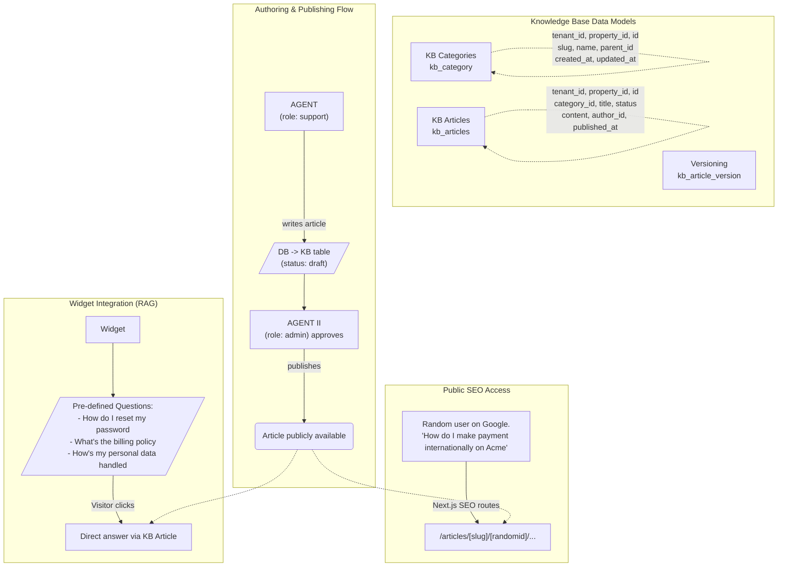

# Knowledge Base Flow

This document outlines the architecture, data schema, and user flows for the Knowledge Base integration in Parrot. 

## Flow Diagram

## Schema Details
The knowledge base relies on the following tables defined in `packages/db/src/schema.ts`:
- **`kb_category`**: Supports nesting via `parent_id` (e.g. `payment` -> `international payment`). Each property can have custom categories.
- **`kb_articles`**: Contains the actual content. Tracks `status` (`draft` | `published` | `archived`), `author_id`, and ties to a specific `category_id`.
- **`kb_article_version`** (Planned): Will handle versioning for articles to track edits over time.

## User Journeys
1. **Agents**: Support agents draft articles which are saved to the database as drafts. An admin agent reviews and approves the draft, transitioning it to a publicly available state.
2. **Widget Visitors**: When a visitor opens the widget, they are presented with contextually relevant questions (inferred from the integrating business's complexity). Clicking a question retrieves the KB article automatically. Going forward, this content feeds into a RAG (Retrieval-Augmented Generation) model to provide AI responses.
3. **Public Users**: Published articles generate static, SEO-optimized pages using Next.js. Users searching on Google can land directly on `/articles/[slug]/[id]`.
