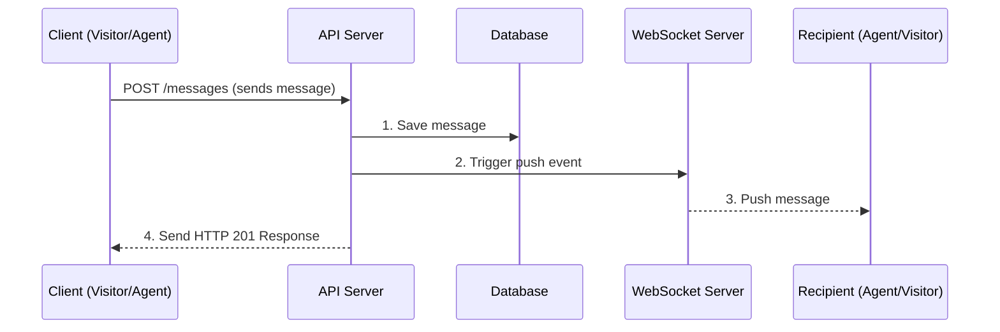

## 2. Event Handling and System Architecture

### Current State: The "Fragile Chain"

While trying to build the end to end system, I was at first confused on what the architectural patterns should be like. I consulted “AI” and of course did my research. And after implementation of what I thought was my draft, I found it working and at least for the first phase of the project this is what I’d stick with.

The idea was using websites for end to end communication. The reason for this is very obvious. It’ll make the whole chat system feel very real time with less delay (exception of network issues). Other options include polling, long open http connection. All of these have one major setback or the other which I won't be detailing in this journal.

This chain of orders is exactly what Parrot is running on. Which is fragile. Parrot would be moving to Redis stream soon. But foer simplicity sake, we’re still with the chain of orders

### Future Roadmap: Moving to Event-Driven Systems

This is where the streams channels come in. Although I haven't really used any of these, this project has made me study the fundamentals of these systems and how they work. I can’t say I truly understand their mechanics but I think I roughly do and I’d explain just the way I understand it.

So instead of handling this incoming message in a chain of orders, we just publish an event via redis and automatically all connected subscribers (notification service , analytics, conversation) and all would immediately get the message (which would be the req body) and then all of them act independently. With this an error in one process wouldn't automatically lead to an error in another, as such things still move smoothly.

#### Redis Pub/Sub

Redis Pub/Sub: This is exactly how Redis pub/sub works. However, it’s not durable. Durable in the sense that data isnt stored on the disk. The data is ephemeral. It’s stored in the network socket buffer. The subscribers in that buffers gets the message once it gets published. This makes sense for things like typing status, online/offline status and other things that a data loss wouldnt really mean anything. But for a system like chats, or trading platform where data loss mean alot, this approach isnt advisable.

One other thing with Redis pub/sub is that it when the data becomes too much, the redis connection is terminated at the network level. To be blunt, this is the client-output buffer limit that redis set. When the consumer isnt consuming as much request as its supposed, there would be backlogs and redis wont risk bloating its memory. As such, it terminates the connection, leading to critical data loss.

#### Redis Streams

Redis Streams: Just like kafka or rock db, this is an append only structure. It appends the data as they come to the log file with timestamps and all. It’s relatively durable, as data is stored in memory. Although there are settings that could make redis store this data on disk. But by default it’s in memory (i.e ram).

This approach makes it reliable. It guarantees that an event is delivered at least once. With the consumer being on the receiving end tagged with the responsibility of acknowledging the event. There's a pending log entry file too that stores event that are yet to be acknowledged by the consumer. So even when the consumer is down, you get to replay those events once that consumer is back. There’s also ability for events to be reclaimed by another consumer.

#### Kafka

Kafka: This is more like an advanced redis stream. It offers what redis stream offers with more. Ability for different consumers to subscribe to one or more partitions in a particular topic. A more robust data persistence. Data is primarily stored on the disk, so data loss isnt part of its headache. This is basically used when events scale is huge e.g. financial trading apps, trace (logs), etc.
